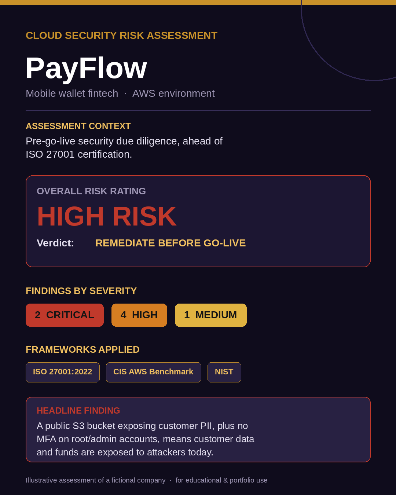
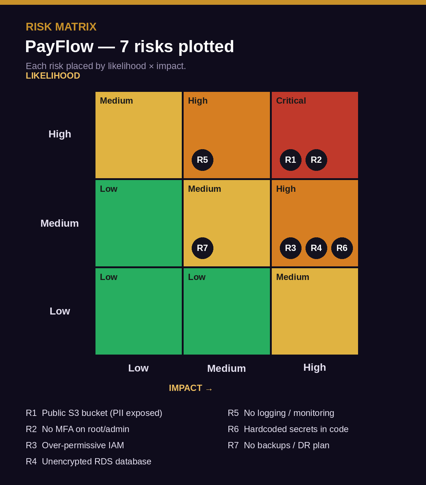

# Cloud Security Risk Assessment — PayFlow (Mobile Wallet, AWS)

> A consulting-style security risk assessment of a fintech's AWS environment, conducted as pre-go-live due diligence ahead of ISO 27001 certification. Risks are identified, scored by likelihood × impact, and mapped to **ISO 27001:2022 Annex A** controls — the way a GRC or cloud security consultant would deliver it.

  

> ⚠️ **Note:** *PayFlow* is a **fictional company** used to illustrate a realistic cloud security assessment methodology. All findings are illustrative, for educational and portfolio purposes.

---

## Executive Summary

This report assesses the AWS environment of **PayFlow**, a mobile wallet fintech that handles customer PII, KYC documents, and transaction data, as **pre-go-live security due diligence** ahead of pursuing ISO 27001 certification.

The assessment identified **7 risks — 2 Critical, 4 High, and 1 Medium** — concentrated in **access control, data protection, and detection**. The two Critical findings (a publicly exposed storage bucket and missing multi-factor authentication on privileged accounts) mean customer data and funds are exposed to compromise in the environment's current state.

**Overall risk rating: High.**
**Verdict: Remediate before go-live.** The environment is **not production-ready** and would **not pass** an ISO 27001 certification audit as-is. The Critical findings must be remediated immediately; the High findings before public launch.

---

## Contents

1. [Scope](#scope)
2. [Methodology](#methodology)
3. [Assets & Data in Scope](#assets--data-in-scope)
4. [Risk Register](#risk-register)
5. [Risk Matrix](#risk-matrix)
6. [Detailed Findings & Control Mapping](#detailed-findings--control-mapping)
7. [Recommended Remediation](#recommended-remediation)
8. [Risk Verdict](#risk-verdict)
9. [Frameworks Referenced](#frameworks-referenced)

---

## Scope

| Field | Detail |
|-------|--------|
| **Organization** | PayFlow (fictional mobile wallet fintech) |
| **Environment** | Amazon Web Services (AWS) |
| **Services assessed** | IAM, S3, RDS, EC2, CloudTrail, application secrets |
| **Assessment type** | Pre-go-live security due diligence |
| **Driver** | Preparation for ISO 27001:2022 certification |
| **In scope** | Cloud configuration, identity & access, data protection, logging |
| **Out of scope** | Application-layer penetration testing, physical security, staff vetting |

---

## Methodology

Risks were identified through a configuration review of the AWS environment and assessed against the **CIS AWS Foundations Benchmark** and **NIST** cloud security guidance. Each risk was scored on **likelihood × impact** (Low / Medium / High), producing a risk level from a standard 3×3 matrix where High likelihood × High impact = Critical. Every risk is then mapped to the relevant **ISO 27001:2022 Annex A** control, so remediation directly supports the certification effort.

> **Scoring key:** Likelihood = how probable exploitation is given the current config. Impact = business consequence (data loss, financial loss, regulatory penalty) if exploited.

---

## Assets & Data in Scope

| Asset | Data sensitivity |
|-------|-----------------|
| Customer accounts & profiles | **PII** — names, phone numbers, addresses |
| KYC documents | **Highly sensitive** — ID cards, selfies, proof of address |
| Transaction records | **Sensitive** — financial history, balances |
| Authentication credentials | **Critical** — access to funds and admin |
| Application secrets & keys | **Critical** — keys to the whole environment |

For a fintech, the impact ceiling is high across the board: a breach means financial loss, regulatory penalty (data protection law), and irreversible loss of customer trust.

---

## Risk Register

| ID | Risk | Category | Likelihood | Impact | Level | ISO 27001:2022 Control |
|----|------|----------|:----------:|:------:|:-----:|------------------------|
| **R1** | Public S3 bucket exposing customer PII & KYC documents | Data Exposure | High | High | 🔴 Critical | A.8.9, A.8.3, A.5.23 |
| **R2** | No MFA on root & privileged IAM accounts | Access Control | High | High | 🔴 Critical | A.8.5, A.5.17 |
| **R3** | Over-permissive IAM policies (no least privilege) | Access Control | Medium | High | 🟠 High | A.8.2, A.5.18 |
| **R4** | Unencrypted RDS storing transactions & PII | Data Protection | Medium | High | 🟠 High | A.8.24 |
| **R5** | CloudTrail logging & monitoring not enabled | Detection & Response | High | Medium | 🟠 High | A.8.15, A.8.16 |
| **R6** | Hardcoded API keys & DB credentials in code | Secrets Management | Medium | High | 🟠 High | A.5.17, A.8.24 |
| **R7** | No automated backups or DR plan | Resilience | Medium | Medium | 🟡 Medium | A.8.13, A.5.30 |

---

## Risk Matrix

  

The upper-right cluster (**R1, R2**) is where attention must go first — these are the findings that make the environment unsafe to launch.

---

## Detailed Findings & Control Mapping

### 🔴 R1 — Public S3 bucket exposing customer PII & KYC *(Critical)*
A storage bucket holding customer KYC documents is readable without authentication. Anyone with the URL can download identity documents. **This is a live data breach waiting to be discovered.**
**ISO 27001 mapping:** *A.8.9 Configuration Management* (the bucket was misconfigured), *A.8.3 Information Access Restriction*, *A.5.23 Information Security for Use of Cloud Services.*

### 🔴 R2 — No MFA on root & privileged accounts *(Critical)*
The AWS root account and admin IAM users have no multi-factor authentication. A single leaked or phished password gives an attacker full control of the environment — and the funds.
**ISO 27001 mapping:** *A.8.5 Secure Authentication* (which explicitly recommends MFA), *A.5.17 Authentication Information.*

### 🟠 R3 — Over-permissive IAM policies *(High)*
IAM users and roles are granted broad permissions (e.g. `*:*`) rather than least privilege. A single compromised credential has an oversized blast radius.
**ISO 27001 mapping:** *A.8.2 Privileged Access Rights*, *A.5.18 Access Rights.*

### 🟠 R4 — Unencrypted RDS database *(High)*
The database holding transactions and PII is not encrypted at rest. A snapshot leak or disk-level compromise exposes everything in plaintext.
**ISO 27001 mapping:** *A.8.24 Use of Cryptography.*

### 🟠 R5 — No logging or monitoring *(High)*
CloudTrail is disabled and no monitoring/alerting exists. If an attacker gets in, **there is no record and no alarm** — the breach would go undetected.
**ISO 27001 mapping:** *A.8.15 Logging*, *A.8.16 Monitoring Activities.*

### 🟠 R6 — Hardcoded secrets in code *(High)*
API keys and database credentials are committed in source code / config rather than a secrets manager. Anyone with repo access — or a leaked repo — gets the keys.
**ISO 27001 mapping:** *A.5.17 Authentication Information*, *A.8.24 Use of Cryptography* (key management).

### 🟡 R7 — No backups or DR plan *(Medium)*
No automated backups or disaster-recovery plan. Ransomware, accidental deletion, or a region outage could mean permanent data loss and extended downtime.
**ISO 27001 mapping:** *A.8.13 Information Backup*, *A.5.30 ICT Readiness for Business Continuity.*

---

## Recommended Remediation

| Priority | Action | Fixes | Control |
|:--------:|--------|:-----:|---------|
| **Now** | Make the S3 bucket private; block public access account-wide | R1 | A.8.9 |
| **Now** | Enforce MFA on root + all privileged IAM users | R2 | A.8.5 |
| **Before launch** | Rewrite IAM policies to least privilege; remove wildcard grants | R3 | A.8.2 |
| **Before launch** | Enable RDS encryption at rest (and enforce TLS in transit) | R4 | A.8.24 |
| **Before launch** | Enable CloudTrail across all regions + CloudWatch alerts | R5 | A.8.15/16 |
| **Before launch** | Move secrets to AWS Secrets Manager; rotate exposed keys | R6 | A.5.17 |
| **Roadmap** | Automate backups + document and test a DR plan | R7 | A.8.13 |

---

## Risk Verdict

> ### ⛔ High Risk — Remediate Before Go-Live
>
> PayFlow's AWS environment is **not production-ready** and would **not pass** an ISO 27001 certification audit in its current state.
>
> - **Immediately:** remediate the 2 Critical findings (R1, R2) — customer data and funds are exposed right now.
> - **Before public launch:** remediate the 4 High findings (R3–R6).
> - **On the roadmap:** address R7 (resilience) and re-assess.
>
> Once remediated, a follow-up assessment should confirm the environment is ready for go-live and for the certification audit.

The good news: every finding here is a **known, fixable misconfiguration** — most can be closed in days, not months. Nothing requires re-architecture, only disciplined configuration and access hygiene.

---

## Frameworks Referenced

- **ISO 27001:2022 Annex A** — controls A.5.17, A.5.18, A.5.23, A.5.30, A.8.2, A.8.3, A.8.5, A.8.9, A.8.13, A.8.15, A.8.16, A.8.24
- **CIS AWS Foundations Benchmark** — configuration baselines for IAM, S3, logging, and encryption
- **NIST** — cloud security and risk management guidance

---

Illustrative cloud security risk assessment of a fictional company · for educational and portfolio purposes

